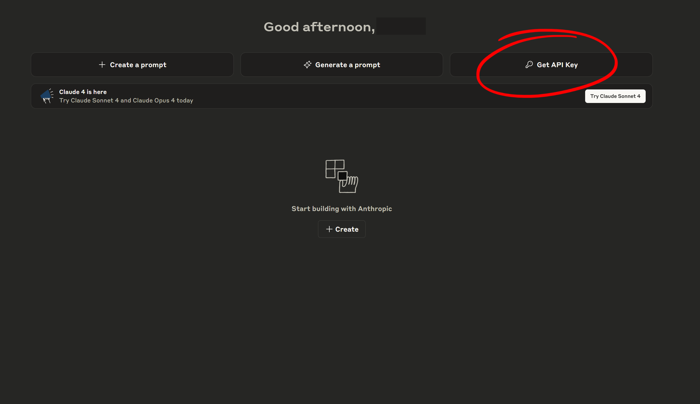

# Anthropic

## **Create an** Anthropic **account**

If you haven't done so already, sign up for an account on the [Anthropic platform](https://console.anthropic.com/dashboard). Once logged in, go to the [Dashboard](https://console.anthropic.com/dashboard) to find the page shown below.

## **Navigate to Get API Key**

<figure><figcaption></figcaption></figure>

## **Generate a new API key**

<figure><figcaption></figcaption></figure>

Click on the "<mark style="color:red;">**Create Key**</mark>" button to generate your API key.

After generating the key, make sure to copy it and paste in the **Unity Preferences window**. If you are not sure how to do it, please refer to[ API Key Setup](./).
