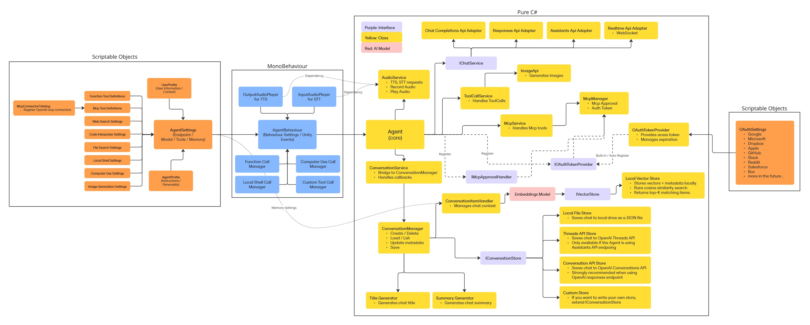

# How Agent Works

AIDevKit Agent is an advanced conversational AI system that provides a unified interface for interacting with various AI LLM providers. This document explains the internal architecture and working principles of the Agent in detail.

## Agent Architecture

<figure><figcaption>Complete architecture structure of AIDevKit Agent</figcaption></figure>

## Core Components

The Agent consists of multiple core components, each responsible for specific functionality.

### 1. Agent Core

The central hub of the Agent that coordinates and manages all components.

```csharp
// Initialize Agent
Agent agent = new Agent(AgentConfiguration.Default);
await agent.InitializeAsync();
```

**Key Responsibilities:**
- Component lifecycle management
- Event coordination and routing
- API communication orchestration
- State management

### 2. AgentControlHub

The central control system that manages Agent state and events.

```csharp
// Detect status changes
agent.OnStatusChanged += (status) => {
    Debug.Log($"Agent status: {status}");
};

// Listen to audio events
agent.OnAudioInputReceived += (audioData) => {
    Debug.Log("Audio input received");
};
```

**Management Areas:**
- `AgentStatus`: Current Agent state (Idle, Listening, Processing, Speaking)
- `Events`: Publishing and subscribing to all Agent events
- `Hooks`: Lifecycle hook execution

### 3. AgentChatApiAdapter

Abstracts and integrates API communication with various LLM providers.

```csharp
// Configure API provider
agent.Configuration.ApiType = AgentApiType.ChatCompletion;
agent.Configuration.Provider = AiProvider.OpenAI;

// Request through unified interface
var response = await agent.SendMessageAsync("Hello!");
```

**Supported API Types:**
- **Chat Completion API**: Standard chat completion API
- **Assistants API**: OpenAI Assistants API
- **Responses API**: Structured response API
- **Realtime API**: Real-time voice conversation API

**Supported Providers:**
- OpenAI
- Google Gemini
- Anthropic Claude
- Other compatible providers

### 4. Controllers

Specialized controllers that manage Agent functionality in detail.

#### ConversationController

Manages conversation history and messages.

```csharp
// Create new conversation
Conversation conversation = agent.CreateConversation();

// Load conversation
await agent.LoadConversationAsync(conversationId);

// Add message
agent.AddMessage(Role.User, "What is AI?");
```

**Features:**
- Conversation creation and loading
- Message history management
- Context maintenance
- Conversation save and restore

#### AudioController

Handles voice input and output.

```csharp
// Start voice input
await agent.StartListeningAsync();

// Generate response from audio
var response = await agent.SendAudioAsync(audioClip);

// Text-to-speech
await agent.SpeakAsync("Hello!");
```

**Features:**
- Speech recognition (STT)
- Text-to-speech (TTS)
- Audio playback control
- Real-time voice streaming

#### ImageController

Manages image generation and vision capabilities.

```csharp
// Generate images
var images = await agent.GenerateImagesAsync("A beautiful sunset");

// Send message with image
await agent.SendMessageAsync("What's in this image?", imageUrl);
```

**Features:**
- AI image generation
- Image analysis (Vision)
- Image editing
- Multimodal interaction

#### ToolController

Manages Agent's tool and function calling capabilities.

```csharp
// Register tool
agent.RegisterTool(new WeatherTool());

// Detect tool execution
agent.OnToolExecuted += (toolName, result) => {
    Debug.Log($"Tool {toolName} executed: {result}");
};
```

**Features:**
- Tool registration and management
- Function call execution
- MCP (Model Context Protocol) integration
- Tool result processing

## Workflow

The complete flow of how Agent processes user requests.

### 1. Sending Messages

```csharp
// Send user message
var response = await agent.SendMessageAsync("Tell me a joke");
```

**Processing Order:**
1. `ConversationController` adds user message to conversation history
2. `AgentControlHub` changes status to `Processing`
3. `OnStatusChanged` event is fired

### 2. API Request

```csharp
// Internal processing steps
// 1. AgentChatApiAdapter selects appropriate API client
// 2. Constructs request parameters
// 3. Executes API call
```

**AgentChatApiAdapter Role:**
- Selects appropriate client based on API type
- Transforms request format per provider
- Manages streaming settings
- Includes tool definitions

### 3. Streaming Response

```csharp
// Handle streaming response
agent.OnStreamingUpdate += (chunk) => {
    Debug.Log($"Received: {chunk}");
};
```

**Streaming Flow:**
1. Receive data in chunks from API
2. Deliver each chunk via `OnStreamingUpdate` event
3. Display text in real-time in UI
4. Accumulate complete response

### 4. Tool Execution

When the Agent determines a tool call is needed:

```csharp
// 1. AI requests tool call
// OnToolCallRequested event is fired

// 2. ToolController executes tool
var result = await toolController.ExecuteToolAsync(toolCall);

// 3. Execution result is sent back to AI
// OnToolExecuted event is fired

// 4. AI generates final response
```

### 5. Response Completion

```csharp
// When response is complete
agent.OnResponseCompleted += (response) => {
    Debug.Log($"AI: {response.Content}");
};
```

**Completion Processing:**
1. Save complete response to `ConversationController`
2. Change status to `Idle`
3. Fire `OnResponseCompleted` event
4. Update token usage and metadata

## Event System

Agent provides a comprehensive event system.

### Status Events

```csharp
agent.OnStatusChanged += (status) => {
    switch (status)
    {
        case AgentStatus.Idle:
            // Agent is waiting
            break;
        case AgentStatus.Listening:
            // Waiting for voice input
            break;
        case AgentStatus.Processing:
            // Generating AI response
            break;
        case AgentStatus.Speaking:
            // Voice output in progress
            break;
    }
};
```

### Conversation Events

```csharp
// Message events
agent.OnMessageAdded += (message) => {
    Debug.Log($"{message.Role}: {message.Content}");
};

// Conversation creation event
agent.OnConversationCreated += (conversation) => {
    Debug.Log($"New conversation: {conversation.Id}");
};
```

### Streaming Events

```csharp
// Streaming started
agent.OnStreamingStarted += () => {
    Debug.Log("Streaming started");
};

// Streaming chunk
agent.OnStreamingUpdate += (chunk) => {
    // Update UI
};

// Streaming completed
agent.OnStreamingCompleted += (fullText) => {
    Debug.Log("Streaming completed");
};
```

### Tool Events

```csharp
// Tool call requested
agent.OnToolCallRequested += (toolCalls) => {
    Debug.Log($"AI requested {toolCalls.Count} tool calls");
};

// Tool execution completed
agent.OnToolExecuted += (toolName, result) => {
    Debug.Log($"{toolName} executed successfully");
};
```

### Audio Events

```csharp
// Voice input
agent.OnAudioInputReceived += (audioData) => {
    Debug.Log("Audio received");
};

// Transcription completed
agent.OnTranscriptionCompleted += (text) => {
    Debug.Log($"Transcribed: {text}");
};

// Speech output started
agent.OnSpeechStarted += () => {
    Debug.Log("Speech started");
};

// Speech output completed
agent.OnSpeechCompleted += () => {
    Debug.Log("Speech completed");
};
```

## State Management

Agent performs state-based operations.

### Agent States

```csharp
public enum AgentStatus
{
    Idle,           // Waiting
    Listening,      // Waiting for voice input
    Processing,     // Processing request
    Speaking,       // Voice output in progress
    Error           // Error occurred
}
```

### State Transitions

```
Idle ──SendMessage──> Processing ──Response──> Idle
  │                                             │
  └──StartListening──> Listening ──Audio──> Processing
  
Idle ──SpeakAsync──> Speaking ──Completed──> Idle
```

**State Transition Example:**
```csharp
// Idle → Processing
await agent.SendMessageAsync("Hello");
// Current status: Processing

// Processing → Idle (automatic)
// Automatically transitions to Idle when response is complete

// Idle → Listening
await agent.StartListeningAsync();
// Current status: Listening

// Listening → Processing
// Automatically transitions to Processing when voice input is complete
```

## Memory Management

Agent can optionally use long-term memory.

```csharp
// Enable memory
agent.Configuration.UseMemory = true;
agent.Configuration.MemorySize = 10; // Remember last 10 interactions

// Agent automatically searches and utilizes relevant memory
await agent.SendMessageAsync("What did I tell you earlier?");
```

**How Memory Works:**
1. Conversation history is stored as vector embeddings
2. Retrieve relevant memories for new queries
3. Automatically include relevant context in prompt
4. AI references past conversations in responses

For more details, see the [Memory](../memory/README.md) section.

## API Communication

How AgentChatApiAdapter handles various API types:

### Chat Completion API

```csharp
agent.Configuration.ApiType = AgentApiType.ChatCompletion;

// Uses standard chat completion API
// - Most common approach
// - All providers supported
// - Streaming supported
```

### Assistants API

```csharp
agent.Configuration.ApiType = AgentApiType.Assistants;
agent.Configuration.AssistantId = "asst_xxxxx";

// Uses OpenAI Assistants API
// - Stateful conversations
// - File attachment support
// - Code interpreter integration
```

### Responses API

```csharp
agent.Configuration.ApiType = AgentApiType.Responses;

// Uses structured response API
// - JSON schema-based responses
// - Type safety
// - Predictable output
```

### Realtime API

```csharp
agent.Configuration.ApiType = AgentApiType.Realtime;

// Uses real-time voice conversation API
// - Low latency
// - Direct voice I/O processing
// - Natural conversation flow
```

## Error Handling

Agent provides comprehensive error handling.

```csharp
// Subscribe to error events
agent.OnError += (error) => {
    Debug.LogError($"Agent error: {error.Message}");
    
    // Handle based on error type
    switch (error.Type)
    {
        case ErrorType.ApiError:
            // API errors (authentication, quota, etc.)
            break;
        case ErrorType.NetworkError:
            // Network errors
            break;
        case ErrorType.ValidationError:
            // Input validation errors
            break;
        case ErrorType.ToolExecutionError:
            // Tool execution errors
            break;
    }
};

// Handle individual operation errors with try-catch
try
{
    await agent.SendMessageAsync("Hello");
}
catch (AgentException ex)
{
    Debug.LogError($"Failed to send message: {ex.Message}");
}
```

## Configuration

Various options for configuring Agent:

```csharp
var config = new AgentConfiguration
{
    // API settings
    ApiType = AgentApiType.ChatCompletion,
    Provider = AiProvider.OpenAI,
    Model = "gpt-4o",
    
    // Conversation settings
    MaxHistoryMessages = 20,
    SystemPrompt = "You are a helpful assistant.",
    
    // Generation parameters
    Temperature = 0.7f,
    MaxTokens = 2000,
    TopP = 1.0f,
    
    // Audio settings
    VoiceId = "alloy",
    AudioFormat = AudioFormat.Wav,
    
    // Tool settings
    ToolChoice = ToolChoice.Auto,
    ParallelToolCalls = true,
    
    // Memory settings
    UseMemory = true,
    MemorySize = 10,
    
    // Streaming settings
    EnableStreaming = true,
    
    // Repository settings
    ConversationRepository = new LocalConversationRepository(),
};

Agent agent = new Agent(config);
```

## Performance Considerations

### Streaming vs Non-Streaming

```csharp
// Streaming: Faster first response, better UX
agent.Configuration.EnableStreaming = true;

// Non-streaming: Receive complete response at once
agent.Configuration.EnableStreaming = false;
```

### Context Window Management

```csharp
// Manage context window by limiting conversation history
agent.Configuration.MaxHistoryMessages = 20;

// Or manually remove old messages
agent.TrimConversationHistory(maxMessages: 10);
```

### Token Optimization

```csharp
// Maximum token limit
agent.Configuration.MaxTokens = 1000;

// Monitor token usage
agent.OnResponseCompleted += (response) => {
    Debug.Log($"Tokens used: {response.Usage.TotalTokens}");
};
```

## Best Practices

### 1. Proper Initialization

```csharp
// ✓ Correct approach
Agent agent = new Agent(configuration);
await agent.InitializeAsync();

// ✗ Wrong approach
Agent agent = new Agent(configuration);
// Using without calling InitializeAsync()
```

### 2. Resource Cleanup

```csharp
// Clean up when Agent usage is complete
await agent.ShutdownAsync();

// Or use using pattern
using (Agent agent = new Agent(configuration))
{
    await agent.InitializeAsync();
    // Use Agent
} // Automatically calls Dispose
```

### 3. Event Subscription Management

```csharp
// ✓ Correct approach: Unsubscribe from events
void OnEnable()
{
    agent.OnResponseCompleted += HandleResponse;
}

void OnDisable()
{
    agent.OnResponseCompleted -= HandleResponse;
}

// ✗ Risk of memory leak
void Start()
{
    agent.OnResponseCompleted += HandleResponse;
    // No unsubscription
}
```

### 4. Error Handling

```csharp
// ✓ Always subscribe to error events
agent.OnError += (error) => {
    // Appropriate error handling
    ShowErrorMessage(error.Message);
};

// ✓ Use try-catch for critical operations
try
{
    await agent.SendMessageAsync(message);
}
catch (Exception ex)
{
    // Recovery logic
}
```

### 5. State Checking

```csharp
// ✓ Check state before operation
if (agent.Status == AgentStatus.Idle)
{
    await agent.SendMessageAsync(message);
}

// ✓ Or wait for state change
await agent.WaitForIdleAsync();
await agent.SendMessageAsync(message);
```

## Next Steps

Now that you understand the core principles of Agent, explore the following:

- **[Agent Services](agent-services.md)** - Service architecture and dependency injection
- **[Controllers](controllers.md)** - Detailed guide for each controller
- **[Event Router](event-router.md)** - Advanced event routing patterns
- **[Custom Chat Services](custom-chat-services.md)** - Custom LLM integration

For practical usage examples, see the [Essentials](../essentials/README.md) section.
