# How Agents Work

This page explains the internal architecture of an Agent and how all the components work together.

## Architecture Overview

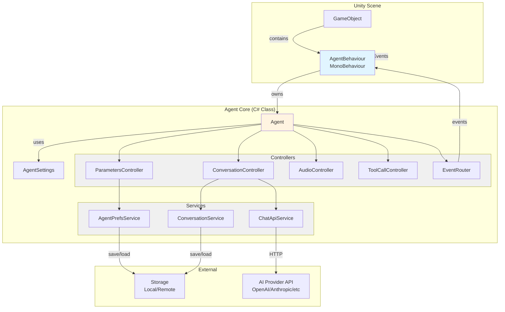

## Component Breakdown

### 1. GameObject & AgentBehaviour (MonoBehaviour)

**AgentBehaviour** is the Unity component you attach to a GameObject. It:

- Handles Unity lifecycle (Start, OnDestroy)
- Exposes UnityEvents for UI/gameplay integration
- Creates and manages the core **Agent** instance
- Bridges Unity and C# pure logic

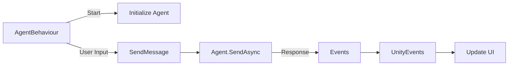

### 2. Agent (Core C# Class)

**Agent** is a pure C# class (no MonoBehaviour) that orchestrates everything:

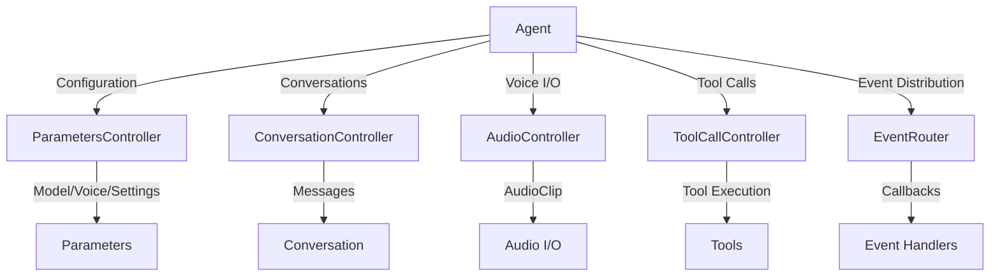

### 3. Controllers

Each controller handles a specific domain:

#### ParametersController

Manages model, voice, and configuration settings:

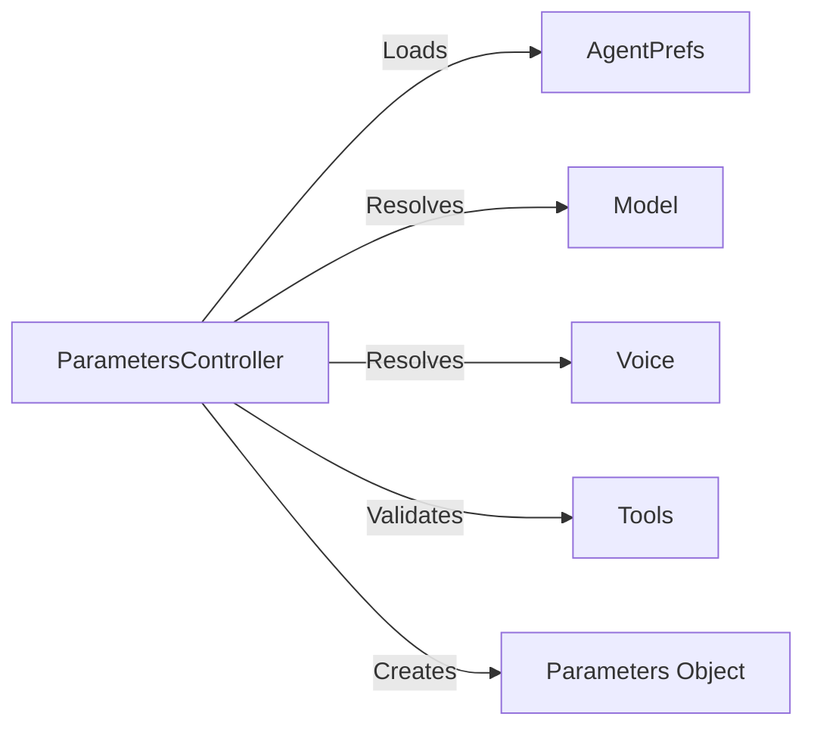

#### ConversationController

Handles message history and context:

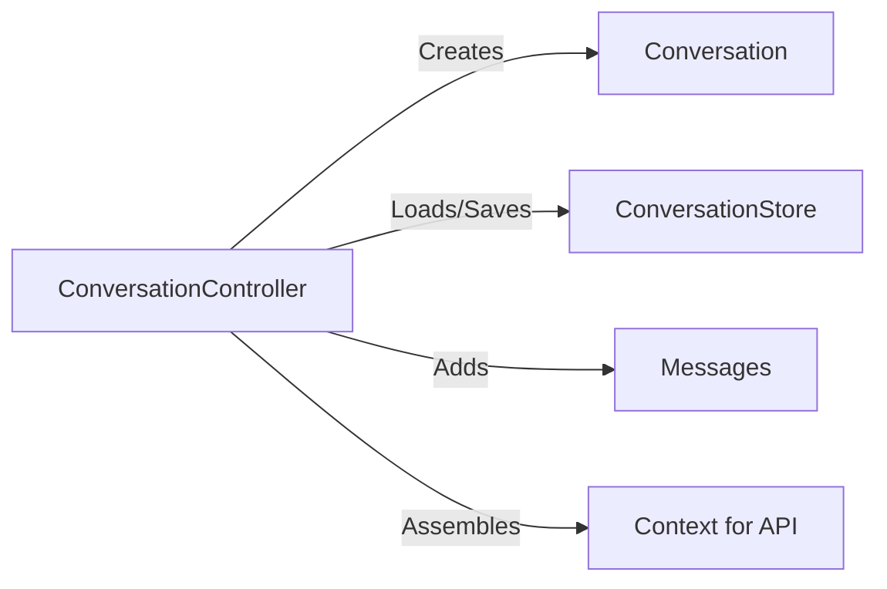

#### AudioController

Manages voice input/output:

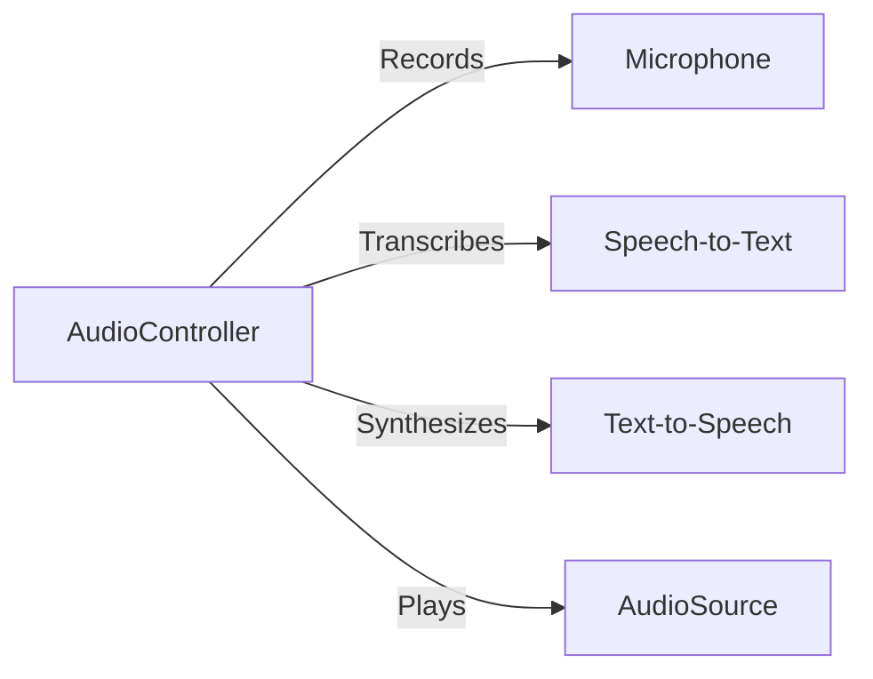

#### ToolCallController

Executes tool calls:

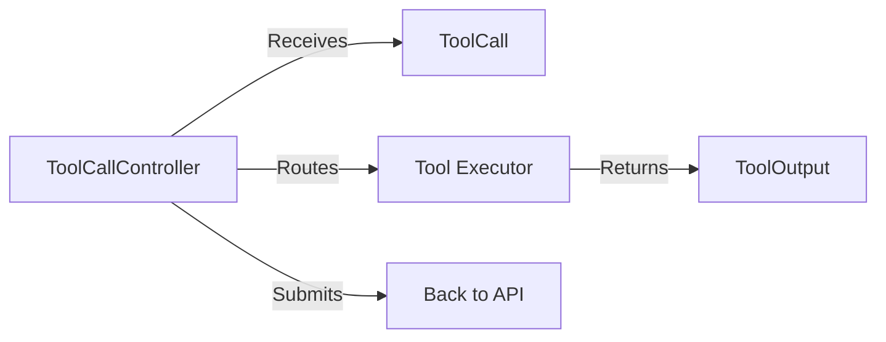

#### EventRouter

Distributes events to listeners:

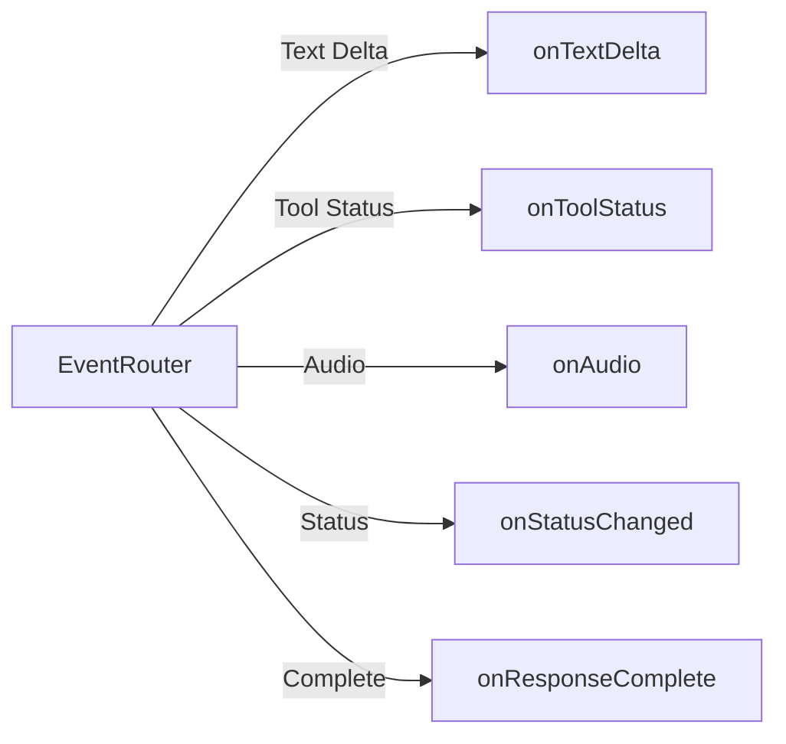

## Message Flow

Here's what happens when you send a message:

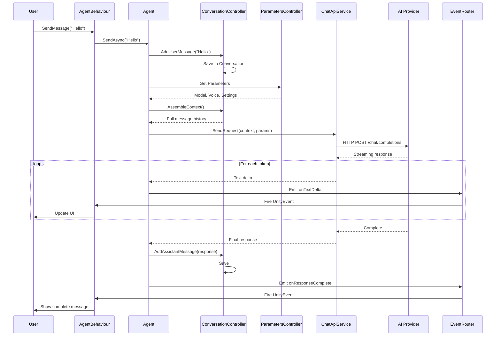

## Tool Call Flow

When the AI wants to use a tool:

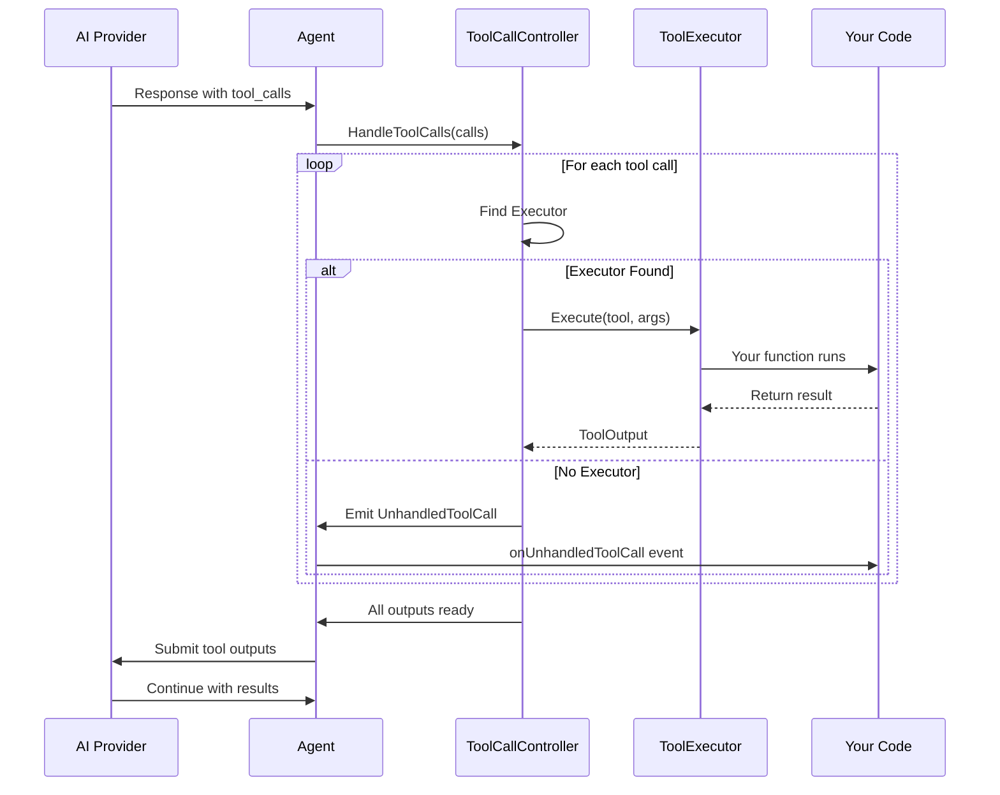

## Initialization Flow

What happens when you start an Agent:

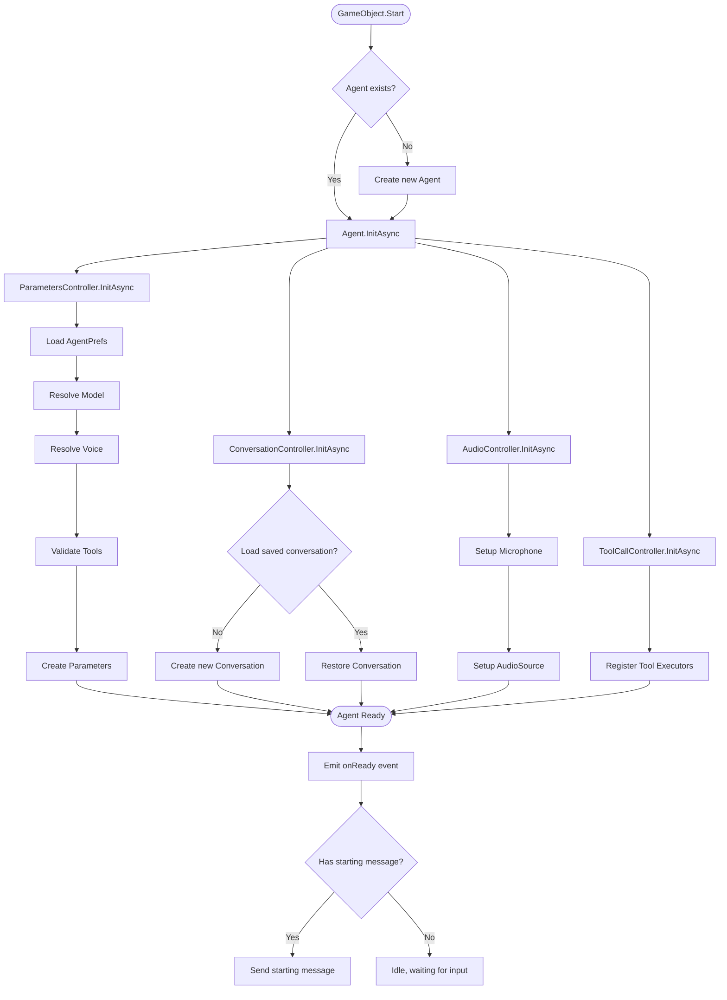

## Status Lifecycle

Agent goes through different statuses:

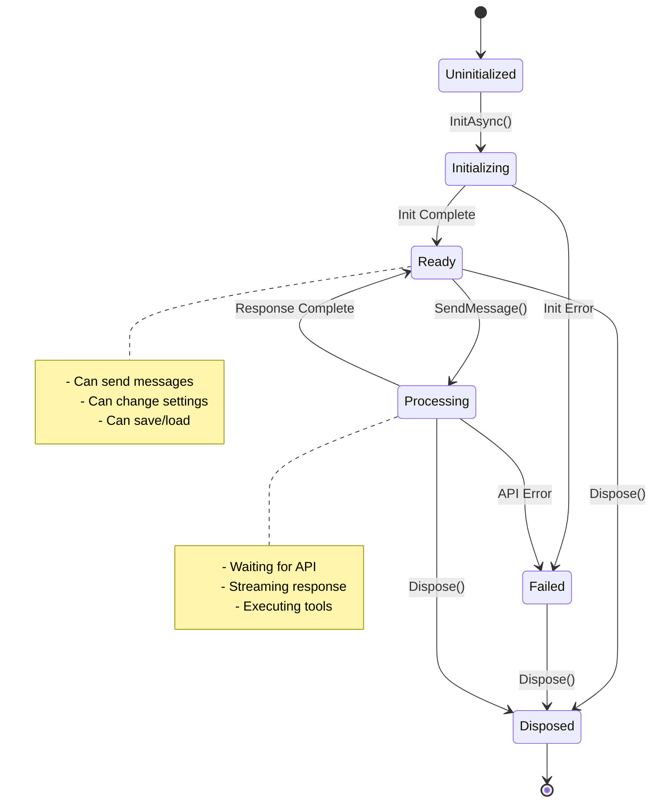

## Data Flow

How data moves through the system:

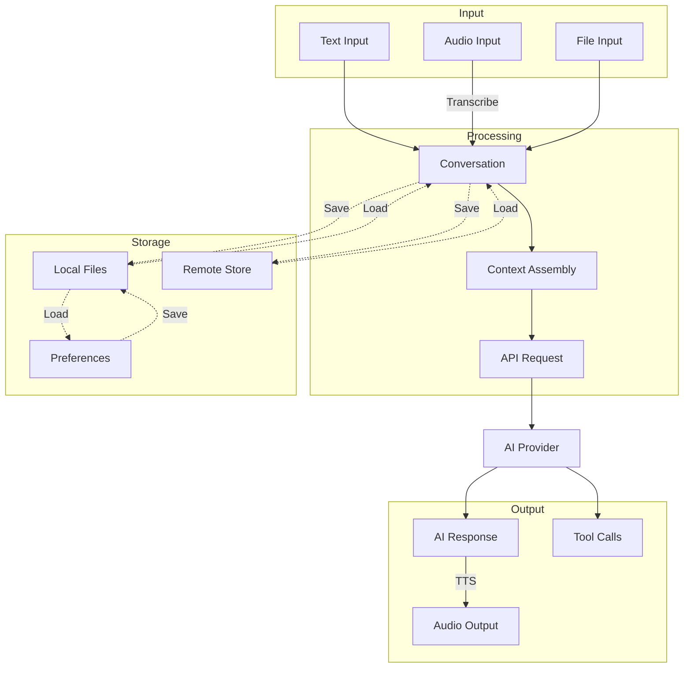

## Key Takeaways

1. **AgentBehaviour** = Unity wrapper (MonoBehaviour)
2. **Agent** = Core logic (pure C#, no Unity dependencies)
3. **Controllers** = Specialized handlers (Parameters, Conversation, Audio, Tools, Events)
4. **Services** = External interactions (API, Storage, Preferences)
5. **EventRouter** = Event distribution hub

This architecture allows:

- ✅ Clean separation of concerns
- ✅ Easy testing (Agent is pure C#)
- ✅ Flexible event handling
- ✅ Modular tool system
- ✅ Multiple storage options

## Next Steps

- [Agent vs Request](agent-vs-request.md) - When to use which approach
- [Your First Agent](your-first-agent.md) - Create your first agent
- [Creating an Agent](../getting-started/creating-agent.md) - Step-by-step guide
